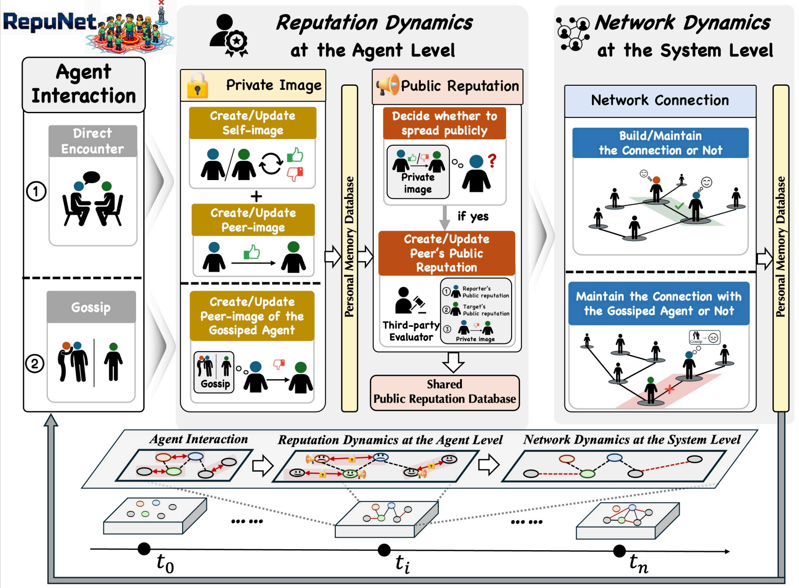
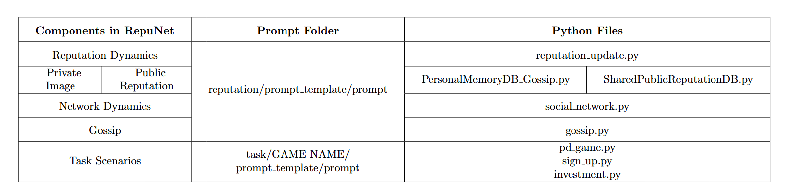

# RepuNet: Building A Networked Reputation System for LLM-based Multi-agent Systems




In this paper, We propose a novel framework named *RepuNet*, a dynamic, dual-level reputation system designed to address the collapse of cooperation in multi-agent systems driven by large language models. This repository includes the complete simulation environment for modeling both agent-level reputation dynamics (via direct interactions and gossip) and system-level network evolution. We offer instructions for setting up the simulation environment on your local machine and reproducing the three distinct interaction scenarios evaluated in our study. 

## Code Guidance



## Requirements

- Python 3.13+
- A virtual environment tool such as `uv`, `venv`, or `conda`
- Access to an OpenAI-compatible API endpoint

## Install

```bash
# create a virtual environment
python -m venv .venv

# activate it
# Windows PowerShell:
.venv\Scripts\Activate.ps1

# install dependencies
pip install -r requirements.txt
```

You can also install with `uv` if you prefer:

```bash
uv venv
uv pip install -e .
```

## Configure `utils.py`

Create `utils.py` in the project root before running anything. A safe template is:

```python
import os

openai_api_key = os.getenv("OPENAI_API_KEY", "sk-your-key")
key_owner = "your_name"

fs_storage = "./sim_storage"

# Current codebase imports api_base directly in several prompt modules.
api_base = os.getenv("OPENAI_API_BASE", "https://api.your-endpoint/v1")

# These are also used by newer helper scripts.
llm_model = os.getenv("LLM_MODEL", "gpt-4o-mini")
llm_api_base = api_base

gpt_default_params = {
    "engine": llm_model,
    "max_tokens": int(os.getenv("LLM_MAX_TOKENS", "4096")),
    "temperature": float(os.getenv("LLM_TEMPERATURE", "0")),
    "top_p": float(os.getenv("LLM_TOP_P", "1")),
    "stream": False,
    "frequency_penalty": float(os.getenv("LLM_FREQUENCY_PENALTY", "0")),
    "presence_penalty": float(os.getenv("LLM_PRESENCE_PENALTY", "0")),
    "stop": None,
}

def default_gpt_params():
    return gpt_default_params.copy()
```

Do not commit a real API key. `utils.py` is already ignored by Git.

## Seed Data

Seeds live under `sim_storage/<sim_name>/step_0` and usually contain:

- `reverie/meta.json`
- `personas/<name>/memory/scratch.json`
- `personas/<name>/memory/associative_memory/nodes.json`
- `personas/<name>/reputation/*.json`

Use the seed generator to create a clean `step_0`:

```bash
python sim_storage/change_sim_folder.py --treatment investment --sim-name demo_invest
python sim_storage/change_sim_folder.py --treatment sign_up --sim-name demo_sign
python sim_storage/change_sim_folder.py --treatment pd_game --sim-name demo_pd
```

Use custom personas from JSON:

```bash
python sim_storage/change_sim_folder.py --treatment pd_game --sim-name demo_pd --persona-file sim_storage/profiles.json
```

Export learned persona descriptions from existing seeds:

```bash
python sim_storage/export_profiles.py --seeds sim_storage/invest_seed sim_storage/pd_game_seed sim_storage/sign_seed --out sim_storage/profiles.json
```

## Run Simulations

### Interactive runner

```bash
python start.py
```

You will be prompted for:

- simulation path under `fs_storage`, for example `investment_seed/step_0`
- whether to use reputation: `y` or `n`
- whether to use gossip: `y` or `n`
- whether to use public reputation: `y` or `n`
- scenario: investment (`i`), sign-up (`s`), or PD game (`p`)

Commands inside the loop:

- `run invest <steps>`
- `run sign <steps>`
- `run pd <steps>`
- `save`
- `fin`
- `exit`

Example:

```text
run sign 1
```

### Non-interactive runner for an existing seed

```bash
python auto_run.py --sim investment_seed/step_0 --mode investment --steps 3 --reputation y --gossip y --public-reputation y
```

### Auto-seed / auto-run / resume

```bash
python scripts/run_simulation.py --scenario pd --steps 5 --reputation y --gossip y --public-reputation y 
```

Resume from an existing run:

```bash
python scripts/run_simulation.py --scenario pd --steps 5 --sim run_pd/step_2
```

## Useful Paths

- `start.py`: interactive runner
- `auto_run.py`: non-interactive runner for an existing seed
- `scripts/run_simulation.py`: auto-seed and resume runner
- `sim_storage/change_sim_folder.py`: seed generator
- `sim_storage/export_profiles.py`: profile exporter
- `sim_storage/profiles.json`: reusable persona profile template
